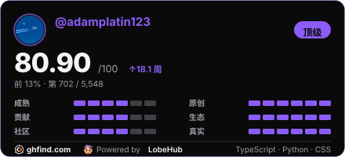

<div align="center">
  
  <p>
    <strong>把 LLM 塞进旧系统、行业流程和真实业务的人。</strong>
  </p>

  <p>
    <code>AI × Bioinfo</code>
    <code>AI 全栈 · 文档智能 · 自建多机网格</code>
  </p>

  <p>
    34 公开仓库 · 顶流 318★ · 11 关注者 · Pull Shark · YOLO · Starstruck ×2
  </p>

  <p>
    <a href="https://ghfind.com/u/adamplatin123">
      
    </a>
  </p>
</div>

---

<table>
<tr>
<td valign="top" width="50%">

#### 教育 · 科研

- **大连理工大学**（2023-2027）· 生物信息学 · 校人工智能社团技术负责人
- **高校课题组科研**：LLM 数据算法优化与 AI 教育应用，两项软件著作权
- **牛津大学 Genexis 团队**：多组学数据预训练模型微调 · BioClaw 自动化 AGENT SaaS
- **企业合作项目**：AI 应用开发，本地大模型长文本处理工具与服务器基础设施优化

</td>
<td valign="top" width="48%">

#### 荣誉 · 专利

> [View Awards →](https://github.com/AdamPlatin123/AdamPlatin123/blob/main/AWARDS.md)

- **科大讯飞医疗咨询问答优化算法挑战赛 冠军**（队长）
- **全国大学生计算机大赛 AI 赛道 全国三等奖**（队长）
- **信通院"光华杯"智慧教育专题赛 全国二等奖**
- 大创国家级 ×2（队长）· 美赛 H 奖 · 软著 2 项 · **专利 2 项在审**

</td>
</tr>
</table>

<p>
  <code>Python</code> <code>Go</code> <code>LLM 微调</code> <code>RAG 应用</code> <code>Agent 开发</code> <code>Docker</code> <code>Linux</code> <code>Claude Code</code>
</p>

---

## 机器档案

```
┌──────────────────────────────────────────────────┐
│  日常笔记本   Linux Mint 工作站                    │
│  v2rayA 代理 · ZeroTier · rEFInd · WPS           │
│  Bambu 3D 打印 · Minecraft · 竞赛提交             │
│  _Projects 档案柜 (共享盘)                        │
└───────────────────────┬──────────────────────────┘
                        │ ssh
                        ▼
┌──────────────────────────────────────────────────┐
│  计算服务器   Ubuntu 24.04                        │
│  Docker 服务群：文档解析 · 模型网关 · 知识库          │
│  远程终端 · 语音 · 数据代理                         │
│  虚拟化实验 · 自托管服务 · 数据分析                  │
└──────┬──────────────────────┬────────────────────┘
       │ 加密隧道              │ 校园实验网
       ▼                      ▼
  管理堡垒机 + GPU 工作站集群   实验网工作机 · 评测服务
  显存总量约 400GB · ● 在线     ○ 到校才上线
       └── EasyTier 网格 ── 设备节点 ● / 其余随用随开
```

> 多机舰队，一台笔记本干日常，一台服务器跑服务，中间用自研 EasyTier 网格串起来。状态为最近一次巡检记录。

<table style="border-collapse:collapse;width:100%;font-size:14px">
<tr>
<td style="border:1px solid #1f2c46;background:#111a2e;border-radius:8px;padding:12px 14px;width:50%;vertical-align:top">
<div style="font-family:'Songti SC','Noto Serif CJK SC',Georgia,serif;font-weight:700;color:#e8eef7">
<span style="color:#e8a33d">●</span> 日常笔记本 <span style="font-family:ui-monospace,Consolas,monospace;font-weight:400;color:#5aa9e6;font-size:12px">Linux Mint 工作站</span>
</div>
<div style="color:#9aa7bd;margin-top:6px;line-height:1.7;font-family:'PingFang SC','Noto Sans CJK SC','Microsoft YaHei',sans-serif">
日常与项目中枢：竞赛提交（基因组医学、气动预测）从这里打包出发；LLM Agent 工程与研究（生物医学 Agent、Agent 终端皮肤设计、外部研究）在此落地；行业文本合作与医疗预警应用的开发维护；学术论文与数据分析产出。共享盘 _Projects 装着 30 余个条目的完整档案，各台机器的产物最终都归档到这里。
</div>
</td>
<td style="border:1px solid #1f2c46;background:#111a2e;border-radius:8px;padding:12px 14px;width:50%;vertical-align:top">
<div style="font-family:'Songti SC','Noto Serif CJK SC',Georgia,serif;font-weight:700;color:#e8eef7">
<span style="color:#e8a33d">●</span> 计算服务器 <span style="font-family:ui-monospace,Consolas,monospace;font-weight:400;color:#5aa9e6;font-size:12px">Ubuntu 24.04</span>
</div>
<div style="color:#9aa7bd;margin-top:6px;line-height:1.7;font-family:'PingFang SC','Noto Sans CJK SC','Microsoft YaHei',sans-serif">
Docker 服务群：文档解析、模型网关、知识库、远程终端、语音与数据代理等业务容器；虚拟化实验与自托管服务；数据分析流水线。
</div>
</td>
</tr>
<tr>
<td style="border:1px solid #1f2c46;background:#111a2e;border-radius:8px;padding:12px 14px;width:50%;vertical-align:top">
<div style="font-family:'Songti SC','Noto Serif CJK SC',Georgia,serif;font-weight:700;color:#e8eef7">
<span style="color:#e8a33d">●</span> 自建网格 <span style="font-family:ui-monospace,Consolas,monospace;font-weight:400;color:#5aa9e6;font-size:12px">EasyTier 加密隧道</span>
</div>
<div style="color:#9aa7bd;margin-top:6px;line-height:1.7;font-family:'PingFang SC','Noto Sans CJK SC','Microsoft YaHei',sans-serif">
笔记本、服务器、设备通过自研 EasyTier mesh 互通，随时随地上线即达。设备侧节点在线；其余节点随用随开。网格本身也是开源项目：<a href="https://github.com/AdamPlatin123/genexis-easytier">genexis-easytier</a>。
</div>
</td>
<td style="border:1px solid #1f2c46;background:#111a2e;border-radius:8px;padding:12px 14px;width:50%;vertical-align:top">
<div style="font-family:'Songti SC','Noto Serif CJK SC',Georgia,serif;font-weight:700;color:#e8eef7">
<span style="color:#e8a33d">●</span> GPU 工作站集群 <span style="font-family:ui-monospace,Consolas,monospace;font-weight:400;color:#5aa9e6;font-size:12px">加密隧道接入 · 显存总量约 400GB</span>
</div>
<div style="color:#9aa7bd;margin-top:6px;line-height:1.7;font-family:'PingFang SC','Noto Sans CJK SC','Microsoft YaHei',sans-serif">
校园网内的训练与推理集群，经管理堡垒机加密隧道接入。竞赛训练流水线、模型微调与推理服务都跑在这里。
</div>
</td>
</tr>
</table>

---

## 代码工作

### 代表作

<table style="border-collapse:collapse;width:100%;font-size:14px">
<tr>
<td style="border:1px solid #1f2c46;background:#111a2e;border-radius:8px;padding:10px 14px;width:50%;vertical-align:top">
<a href="https://github.com/AdamPlatin123/Open-Deep-Research-workflow-on-Dify" style="color:#e8a33d;text-decoration:none;font-weight:700">Open-Deep-Research-workflow-on-Dify</a>
<span style="color:#7d8aa0;font-family:ui-monospace,Consolas,monospace;font-size:12px"> ★318 · fork 60</span>
<div style="color:#9aa7bd;margin-top:4px;line-height:1.6">Dify 上的深度研究工作流，被广泛 fork 的入门级 deep research 方案。</div>
</td>
<td style="border:1px solid #1f2c46;background:#111a2e;border-radius:8px;padding:10px 14px;width:50%;vertical-align:top">
<a href="https://github.com/AdamPlatin123/BioHermes" style="color:#e8a33d;text-decoration:none;font-weight:700">BioHermes</a>
<span style="color:#7d8aa0;font-family:ui-monospace,Consolas,monospace;font-size:12px"> Python</span>
<div style="color:#9aa7bd;margin-top:4px;line-height:1.6">2026 MinerU 数据智能挑战赛赛道二参赛作品。基于 hermes-agent 的计算生物学 Agent：Judge→Select→Execute→Verify 四层闭环（非 ReAct/LangGraph），75 个 OpenScience 技能，Podman 沙箱 + 溯源 + L2 自愈，配套 React SPA。</div>
</td>
</tr>
<tr>
<td style="border:1px solid #1f2c46;background:#111a2e;border-radius:8px;padding:10px 14px;width:50%;vertical-align:top">
<a href="https://github.com/AdamPlatin123/gomoku_rl_demo" style="color:#e8a33d;text-decoration:none;font-weight:700">gomoku_rl_demo</a>
<span style="color:#7d8aa0;font-family:ui-monospace,Consolas,monospace;font-size:12px"> Python</span>
<div style="color:#9aa7bd;margin-top:4px;line-height:1.6">五子棋 AlphaZero 训练演示：残差策略价值网络 + MCTS，自我对弈实时可视化，三模式 GPU 切换。</div>
</td>
<td style="border:1px solid #1f2c46;background:#111a2e;border-radius:8px;padding:10px 14px;width:50%;vertical-align:top">
<a href="https://github.com/AdamPlatin123/retroagent-win3.2" style="color:#e8a33d;text-decoration:none;font-weight:700">retroagent-win3.2</a>
<span style="color:#7d8aa0;font-family:ui-monospace,Consolas,monospace;font-size:12px"> Python</span>
<div style="color:#9aa7bd;margin-top:4px;line-height:1.6">QEMU 虚拟串口 + Python Bridge + claude CLI，让 Claude 住进 1994 年的中文 Windows 3.2。</div>
</td>
</tr>
<tr>
<td style="border:1px solid #1f2c46;background:#111a2e;border-radius:8px;padding:10px 14px;width:100%;vertical-align:top">
<a href="https://github.com/AdamPlatin123/genexis-easytier" style="color:#e8a33d;text-decoration:none;font-weight:700">genexis-easytier</a>
<span style="color:#7d8aa0;font-family:ui-monospace,Consolas,monospace;font-size:12px"> Rust</span>
<div style="color:#9aa7bd;margin-top:4px;line-height:1.6">EasyTier 自建网格的部署与设备配套（LGPL-3.0），家里的多机网络就靠它。</div>
</td>
</tr>
<tr>
<td style="border:1px solid #1f2c46;background:#111a2e;border-radius:8px;padding:10px 14px;width:50%;vertical-align:top">
<a href="https://github.com/AdamPlatin123/Docling-webui" style="color:#e8a33d;text-decoration:none;font-weight:700">Docling-webui</a> <span style="color:#7d8aa0;font-family:ui-monospace,Consolas,monospace;font-size:12px"> ★12</span> ·
<a href="https://github.com/AdamPlatin123/Faster-Whisper-WebUI" style="color:#e8a33d;text-decoration:none;font-weight:700">Faster-Whisper-WebUI</a> <span style="color:#7d8aa0;font-family:ui-monospace,Consolas,monospace;font-size:12px"> ★6</span>
<div style="color:#9aa7bd;margin-top:4px;line-height:1.6">文档解析与语音转写的开箱即用 Web 界面，给不想碰命令行的人。</div>
</td>
<td style="border:1px solid #1f2c46;background:#111a2e;border-radius:8px;padding:10px 14px;width:50%;vertical-align:top">
<a href="https://github.com/AdamPlatin123/claude-code-print-skill" style="color:#e8a33d;text-decoration:none;font-weight:700">claude-code-print-skill</a> ·
<a href="https://github.com/AdamPlatin123/claude-code-installer" style="color:#e8a33d;text-decoration:none;font-weight:700">claude-code-installer</a> ·
<a href="https://github.com/AdamPlatin123/Fish-AI-Handbook" style="color:#e8a33d;text-decoration:none;font-weight:700">Fish-AI-Handbook</a>
<div style="color:#9aa7bd;margin-top:4px;line-height:1.6">打印 PDF、零依赖安装、大模型入门手册，实用向的小工具和和朋友们合写的书。</div>
</td>
</tr>
</table>

### 竞赛履历

| 时间 | 竞赛 / 奖项 | 角色 |
|---|---|---|
| 2025.11 | 科大讯飞 医疗咨询问答优化算法挑战赛 冠军 | 队长 |
| 2026.02 | 信通院"光华杯"智慧教育专题赛 全国二等奖（联通合作项目） | 参赛 |
| 2024.08 | 全国大学生计算机大赛 AI 赛道 全国三等奖 | 队长 |
| 2025.08 | 中国国际大学生创新创业比赛 省级银奖 | 队长 |
| 2024.02 | 美国大学生数学竞赛（美赛）H 奖 | 队长 |
| 2025-2027 | 大学生创新创业训练计划 国家级 ×2 | 队长 |

---

## _Projects 档案柜

> 共享盘上的项目仓库，按主题归档，多数在持续维护。

| 主题 | 内容 |
|---|---|
| **行业项目** | 头部国企文本合作项目（AI 应用开发：长文本处理工具 + RAG 文档解析）；LCCPA 肺癌症状预警处置系统（企业微信 H5 问卷 + 规则引擎 + GPU OCR，Fastify + PGlite + React 19）；Tron-Copilot 产品文档；OPC-taskboard（给"一人公司"做的交付凭证层，AGPL 生成器 + MIT 规范） |
| **竞赛** | GenMind 基因组医学；AerogelAI 气动预测；CP-TCG / KDBURI / LIBS-CBCV；FullAutoAgent 全自动参赛系统（会话备份含 68MB 巨型坐庄监控会话） |
| **学术** | 冷启动-学术（不确定性研究论文，LaTeX 全流程）；pbmc 单细胞转录组分析；biohermes（计算生物学 Agent，75 个 OpenScience 技能，PBMC3k 无人值守验收）；AI教育（双轨大学深度研究报告、deep-research-studio） |
| **基建** | run-ml-competition（竞赛流水线 harness，agents/SKILL.md）；system-image（vm-deploy + RustDesk 部署）；easytier-test；GPU-research（Qwen3.6-MinerU 选型调研） |
| **玩** | LegacyCode（Windows 3.2 复古项目）；chatlog（微信数据库读取 + MCP 服务）；3D 打印（Bambu N30 电机座参数化模型）；Minecraft 模组服 |

---

## 时间线

- **2023-12** 注册 GitHub，从 GeminiProChat fork 开始
- **2024** 泡在 Dify / FastGPT 生态里，攒工作流
- **2025-02** <a href="https://github.com/AdamPlatin123/Open-Deep-Research-workflow-on-Dify">Open-Deep-Research-workflow-on-Dify</a>，318 星
- **2025** Docling-webui、Faster-Whisper-WebUI、Fish-AI-Handbook
- **2026** BioHermes v2、genexis-easytier、gomoku_rl_demo、retroagent-win3.2

## Contact me

- Email：AdamPlatin123@outlook.com
- GitHub：https://github.com/AdamPlatin123
- 欢迎就 LLM 应用、竞赛、开源协作交流
